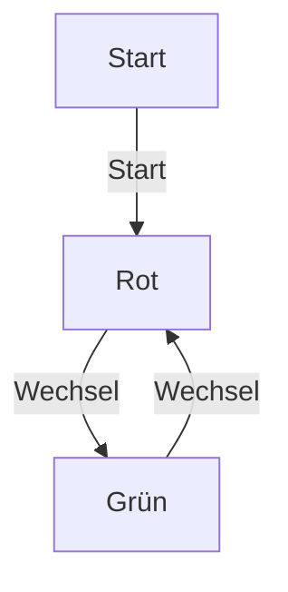
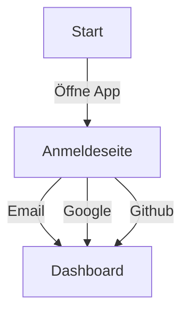
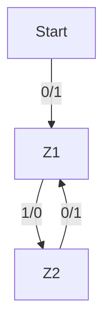
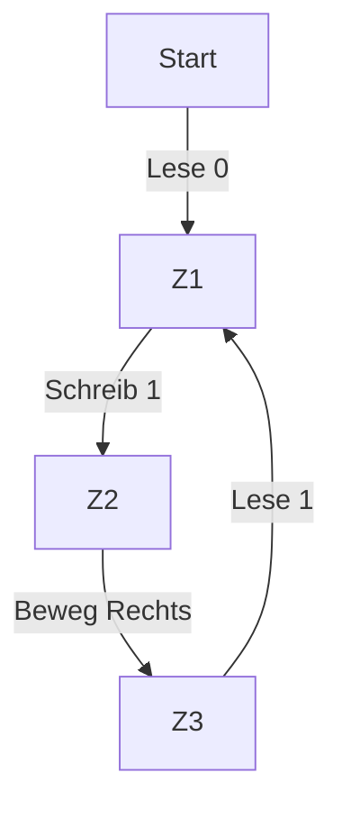

# Einführung in die Automatentheorie 1/8
Automaten sind Modelle für rechnende Maschinen welche einen Zustand (State) haben können.

#### Erklärung
- Zustand: Wo der Automat gerade ist, z.B. "an" oder "aus".

#### Themen:
- Endliche Automaten
- Nichtdeterministische Automaten
- Übergangsfunktionen

---
transition: fade-out
---
# Einführung in die Automatentheorie 2/8

#### Endliche Automaten (DFA) 
Deterministic Finite Automaton (Deterministischer Endlicher Automat) 
Eindeutiger nächster Zustand für jede Eingabe und jeden aktuellen Zustand.
#### Definition:
- Deterministisch: Eindeutiger nächster Zustand
- Formale Definition: $(Q, \Sigma, \delta, q_0, F)$

#### Erklärung
- $Q$: Menge aller Zustände
- $\Sigma$: Menge der Symbole (Eingabe)
- $\delta$: Übergangsfunktion
- $q_0$: Startzustand
- $F$: Menge der Endzustände

#### Merksatz
- DFA ist der einfachste Automatentyp.

---
transition: fade-out
---
# Einführung in die Automatentheorie 3/8

#### Beispiel Aufgabe
- Zeichnet einen DFA für eine Ampel, die nur "rot" und "grün" kennt.

#### Beispiel:

---
transition: fade-out
---
# Einführung in die Automatentheorie 4/8

#### Nichtdeterministische Automaten (NFA)
- Mehrere mögliche nächste Zustände
- Formale Definition: $(Q, \Sigma, \Delta, q_0, F)$

#### Merksatz
- NFA erlauben mehr Freiheit, aber gleiche Ausdruckskraft wie DFA.

#### Erklärung
- $2^Q$: Menge der möglichen Zustandskombinationen

---
transition: fade-out
---
# Einführung in die Automatentheorie 5/8

#### Beispiel Aufgabe
- Zeichnet einen NFA für eine App in der man sich nach dem Start mit Email, Google oder Github anmelden kann und danach zu einem Dashboard kommt.

---
transition: fade-out
---
# Einführung in die Automatentheorie 6/8

#### Übergangsfunktionen
- DFA: $\delta: Q \times \Sigma \rightarrow Q$
- NFA: $\Delta: Q \times \Sigma \rightarrow 2^Q$

#### Merksatz
- Übergangsfunktionen bestimmen die Dynamik des Automaten.

#### Erklärung
- $\rightarrow$: "führt zu" oder "wird zu"

---
transition: fade-out
---
# Einführung in die Automatentheorie 7/8

#### Anwendungen der Automatentheorie
- Textverarbeitung: z.B. Rechtschreibprüfung
- Netzwerkprotokolle: Regeln für Datenübertragung
- Compilerbau: Umwandlung von Quellcode in Maschinencode

## Aufgabe 
- Nennt 5 Anwendungsbeispiele für Automaten in der Praxis und zeichnet einen DFA oder NFA für jedes Beispiel.

Nutzt gerne:
https://mermaid.live/

---
transition: fade-out
layout: two-cols
---
<template v-slot:default>

# Einführung in die Automatentheorie 8/8

### Mealy- und Moore-Automat
Beide Automaten sind deterministisch und sind in der Lage Ausgaben zu erzeugen.

</template>
<template v-slot:right>

### Turingmaschine
Turingmaschinen sind nicht deterministisch und lassen nur mit nichtdeterministischen Automaten simulieren.

</template>
